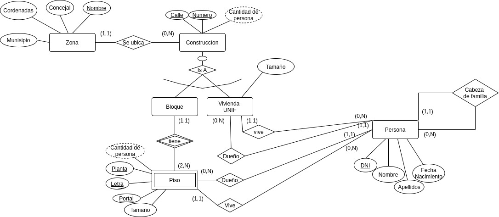
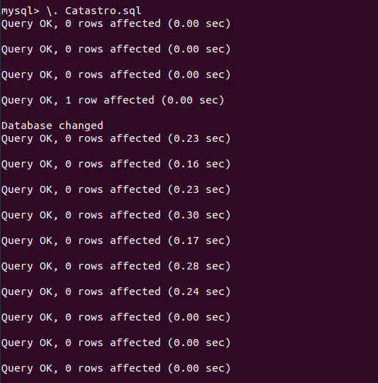
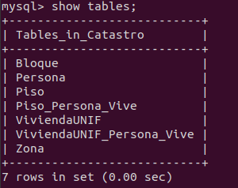

# Práctica Modelo Lógico Relacional

## Enunciado
Crear el esquema de la BDD del diseño lógico  utilizando el software MySql Workbench correspondiente al modelo conceptual de:

* La empresa de viveros
* La Base de Datos del Catastro

## Solución
### Catastro

#### Diseño relacional 

#### Diseño en Workbench 

#### Incorporacion del Script en la Base de Datos

 Tablas creadas en la base de datos 

### Viveros

